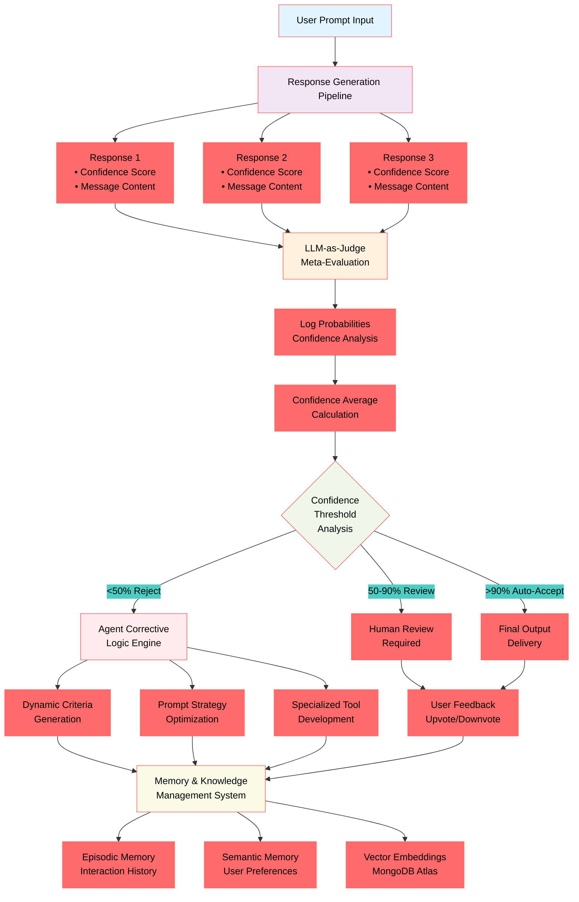
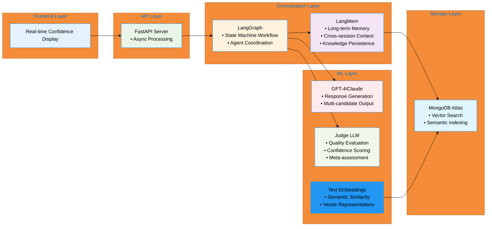
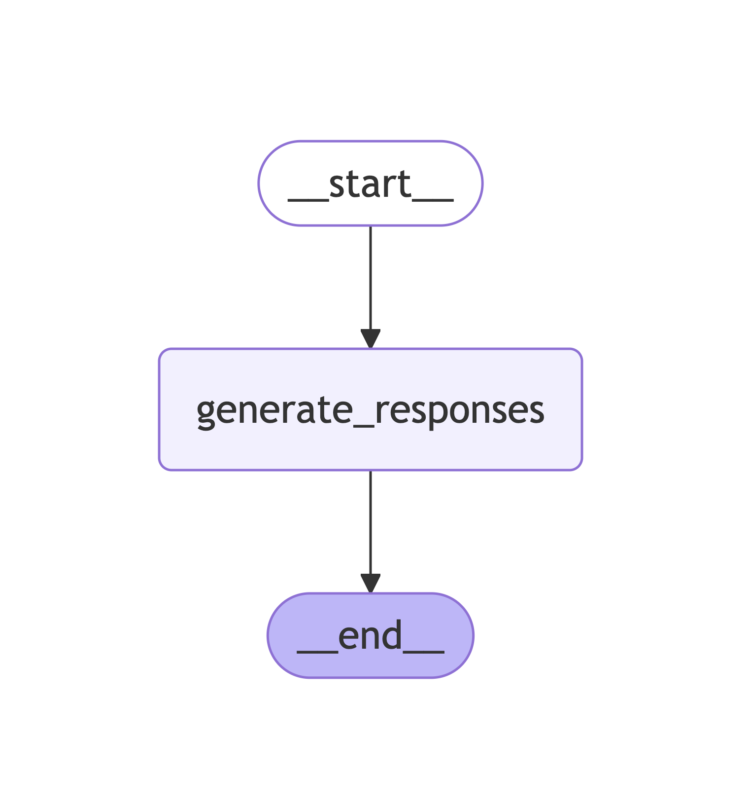

# Self-Aware Agent Architecture

The Agent System is an adaptive AI architecture that autonomously generates evaluation criteria, produces multiple response candidates, and iteratively improves through confidence-based self-correction. The system leverages LLM-as-a-judge mechanisms combined with log probability confidence scoring to deliver high-quality outputs while continuously enhancing its own evaluation capabilities and prompt strategies.

## Core Architecture Components

### 1. **Response Generation Pipeline**

- Agent creates 3-5 response candidates for each user prompt
- Each response includes explicit chain-of-thought reasoning
- Responses tagged with initial confidence estimates
- Parallel generation paths for diverse output exploration

#### 2. **LLM-as-Judge Meta-Evaluation System**

- Dynamically creates evaluation criteria based on task context
- Multiple specialized judge models for different evaluation aspects
- Extracts confidence scores from model token probabilities
- Configurable confidence thresholds (e.g., >90% auto-accept, 50-90% human review, <50% auto-reject)

#### 3. **Agent Corrective Logic Engine**

- Identifies failure modes and success patterns
- Creates new evaluation criteria based on historical performance
- Generates improved prompts for both response generation and evaluation
- Develops specialized evaluation tools for domain-specific tasks

#### 4. **Memory & Knowledge Management**

- **Episodic Memory**: Stores interaction history and performance metrics
- **Semantic Memory**: Maintains knowledge about user preferences and successful patterns
- **Vector Embeddings**: MongoDB Atlas vector search for semantic similarity matching

### Architecture Flow

```
User Input → Response Generator → Multiple Candidates → Judge Evaluation → 
Confidence Analysis → Threshold Decision → Output/Correction Loop → 
Memory Storage → Pattern Analysis → Criteria/Prompt Updates
```



</br>

#### Technical Stack



#### LangGraph Nodes



- GPT-4/Claude for response generation
- Separate model instance for evaluation tasks
- Log probability extraction and normalization
- Text embedding models for semantic search

#### **Performance KPIs**

- Response quality scores (human evaluation baseline)
- Confidence calibration accuracy (predicted vs. actual quality)
- Self-improvement rate (performance gains over time)
- User satisfaction ratings

#### **Technical Metrics**

- Response latency (<2s for generation, <1s for evaluation)
- Confidence score accuracy (±10% of human assessment)
- Memory retrieval speed (<100ms for semantic search)
- System uptime and reliability (99.9% target)

#### **Quality Assurance**

- Human oversight for low-confidence decisions
- Regular evaluation of judge performance
- Fallback mechanisms for system failures
- Audit trails for all decisions and improvements
